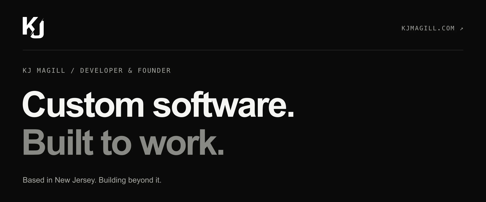

 

[Portfolio ↗](https://kjmagill.com) &nbsp; / &nbsp; [Let’s talk ↗](https://kjmagill.com/contact) &nbsp; / &nbsp; [LinkedIn ↗](https://www.linkedin.com/in/kjmagill/) &nbsp; / &nbsp; [X ↗](https://x.com/kjmagill)

 

I’m KJ, a full-stack developer and founder based in New Jersey. I build thoughtful software for real-world problems, from a business’s first website to products that work in the field and on-chain.

I founded **Flowstate Labs** and [Cape May Web Design](https://www.capemaywebdesign.com), and co-founded [Contrax](https://github.com/Contrax-co/contrax-dapp). My work spans fintech, ecommerce, mobile apps, and the businesses in my own community.

 

01 / SELECTED WORK

## Ideas into outcomes.

| Project | What it does |
| :--- | :--- |
| **[Compbook ↗](https://usecompbook.com)** | Market analysis tools for NBA digital trading cards. |
| **[Contrax ↗](https://github.com/Contrax-co/contrax-dapp)** | Auto-compounding vaults and DeFi tools on Ethereum and Arbitrum. |
| **[Care For Life ↗](https://github.com/kjmagill/care-for-life-fe)** | Offline-first Android app for nonprofit field operations in Africa. |
| **[CanToCurb ↗](https://www.cantocurb.com)** | Online scheduling for a local trash and recycling valet service. |
| **[Back Bay Rentals ↗](https://backbaybuggies.com)** | Online booking for street-legal golf cart rentals in South Jersey. |
| **[Golden Paver ↗](https://github.com/kjmagill/golden-paver)** | A service-business website designed to turn visitors into leads. |

[Explore more work on my website →](https://kjmagill.com/#work)

 

02 / APPROACH & TOOLKIT

## A developer’s craft. A founder’s mindset.

I care about maintainable code, intuitive design, and understanding the business behind the build. I enjoy taking an idea all the way to something people can use.

**Interfaces** &nbsp; React · Next.js · React Native · TypeScript 
**Under the hood** &nbsp; Node.js · Python · SQL · Solidity · Rust 
**Across the build** &nbsp; Product thinking · Technical leadership · Collaboration

Away from the keyboard: the gym, a basketball court, or somewhere I haven’t been before.

 

<!-- Optional stats section: remove from this comment through END STATS to hide all widgets. -->
03 / ON GITHUB

## Always building. Always learning.

  

  

  

<!-- END STATS -->

 

---

### Let’s build something good.

A project, a role, or a conversation. I’m open to the right next thing.

[Get in touch ↗](https://kjmagill.com/contact)
