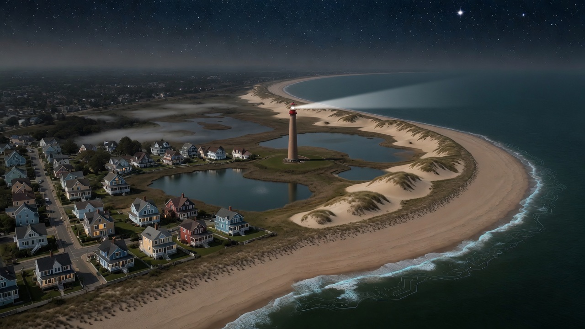
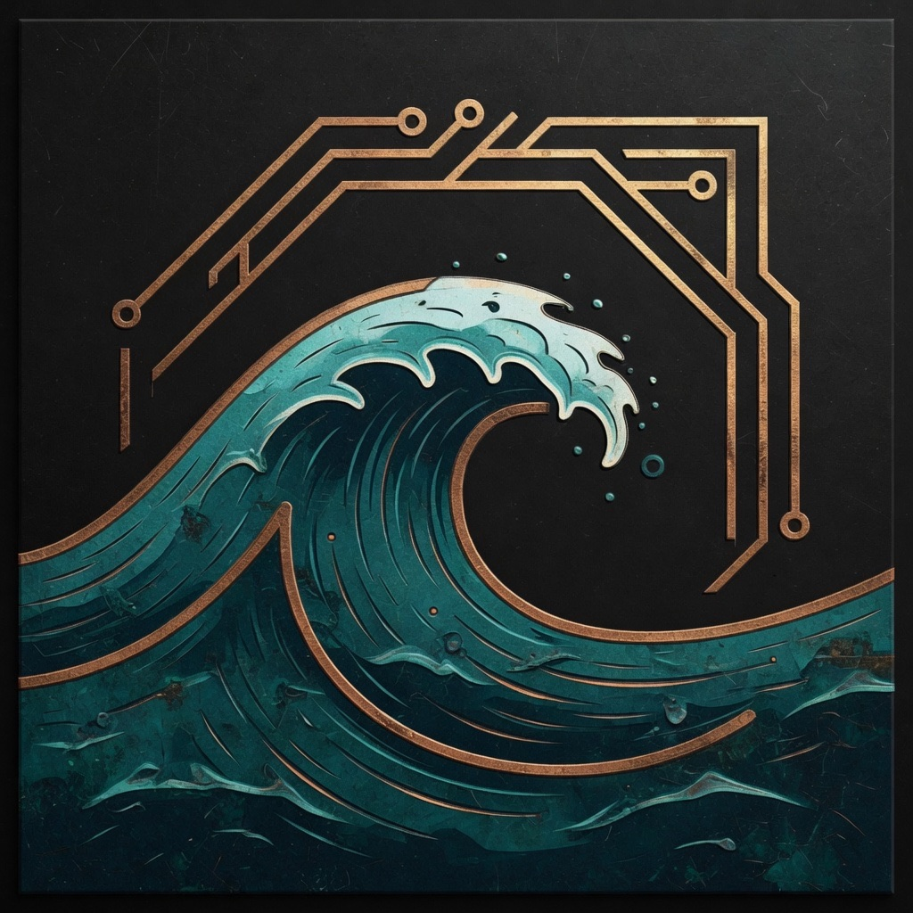
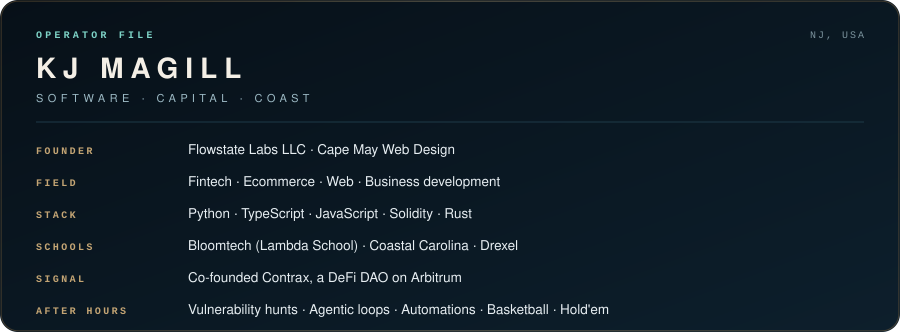

  

 

  

<h1 align="center">KJ MAGILL</h1>

  <em>Software from the Jersey shore.</em>

  <a href="https://kjmagill.com">kjmagill.com</a>
  &nbsp;·&nbsp;
  <a href="https://www.capemaywebdesign.com">Cape May Web Design</a>
  &nbsp;·&nbsp;
  <a href="https://x.com/kjmagill">X</a>
  &nbsp;·&nbsp;
  <a href="https://www.linkedin.com/in/kjmagill/">LinkedIn</a>

  

I build at the seam of **fintech, ecommerce, the web, and business development** — then put it in the world. Founder of **Flowstate Labs** and [Cape May Web Design](https://www.capemaywebdesign.com). Contributor in the engineering workstreams of several DAOs.

The training is three-legged on purpose: full-stack web at **Bloomtech** (Lambda School), applied mathematics at **Coastal Carolina**, business administration at **Drexel**. The languages I reach for most are **Python, TypeScript, JavaScript, Solidity, and Rust**.

After hours I hunt vulnerabilities, run agentic workflows until they loop clean, sit with the nature of reality, then reset on a basketball court or a hold'em table.

  

 

## Selected work

| | |
| :--- | :--- |
| [Compbook](https://github.com/kjmagill/compbook) | Free-to-use, read-only data visualization tool |
| [Contrax dApp](https://github.com/Contrax-co/contrax-dapp) | DeFi tools and auto-compounding vaults on Arbitrum |
| [Care For Life](https://github.com/kjmagill/care-for-life-fe) | Offline-first Android field ops for a US nonprofit |
| [CanToCurb](https://github.com/kjmagill/cantocurb) | Official site for CanToCurb.com |
| [Back Bay Rentals](https://github.com/kjmagill/back-bay-rentals) | Rental and scheduling site for Back Bay golf carts |
| [Golden Paver](https://github.com/kjmagill/golden-paver) | Restoration business on the public web |

  <a href="https://kjmagill.com">More on the portfolio →</a>

 

  

PULSE

  
  

  

